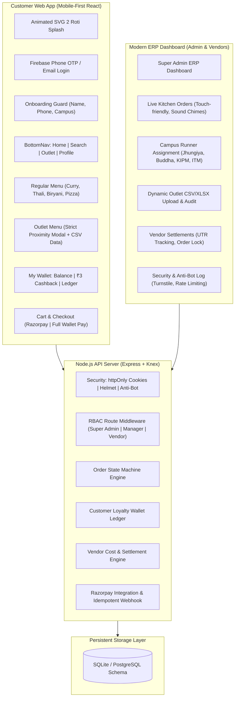
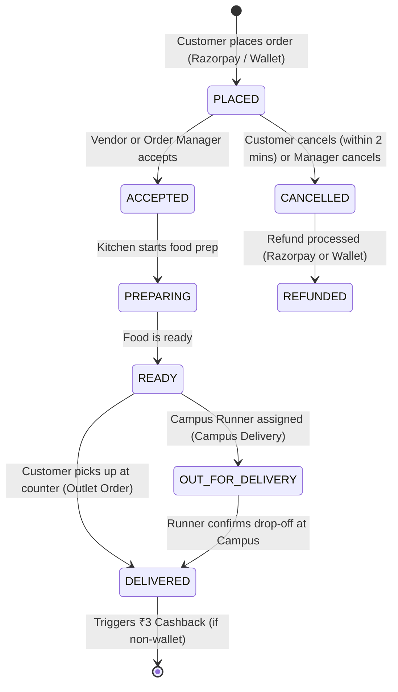

# Production Implementation Plan (Final): 2 Roti Full Ecosystem

A rock-solid, production-grade, and security-audited ecosystem for **2 Roti**, incorporating all finalized business rules, delivery workflows, financial accounting, and safety mechanisms.

---

## Finalized Business Decisions & Open Questions Resolved

### 1. Delivery Model & Campus Dispatch
- **Two Distinct Fulfillment Channels**:
  1. **Campus Delivery** (`Jhungiya`, `Buddha`, `KIPM`, `ITM`):
     - Orders for regular menu items (`Curry`, `Thali`, `Biryani`, `Pizza`).
     - Delivered by campus runners / order dispatchers.
     - Each order has an `assigned_runner` field (runner name & phone, default to Order Manager / Dispatcher).
     - State machine includes `OUT_FOR_DELIVERY` with runner contact visible on customer order tracking.
  2. **Outlet Counter Pickup** (Physical Jhungiya Outlet):
     - Orders from the `Outlet` section.
     - Proximity disclaimer modal strictly enforced.
     - State machine transitions directly: `PLACED` ➔ `ACCEPTED` ➔ `PREPARING` ➔ `READY_FOR_PICKUP` ➔ `DELIVERED` (Picked up at counter).
- **Delivery Fee Policy**:
  - **Outlet Orders**: Always **₹0 (Free self-pickup)**.
  - **Campus Orders**: Configurable in Admin Settings:
    - Default policy: **FREE Campus Delivery on orders $\ge ₹100$**, flat **₹15** for orders under ₹100.
    - Transparent line item in Cart/Checkout: `Delivery Fee: ₹0 (Campus Promo)` or `₹15`.

### 2. Wallet Payment Architecture (Full Redemption Only for v1)
- **Safe & Atomic Design (Zero-Hold / Zero-Loss Risk)**:
  - Split payment (partial wallet + partial Razorpay) is postponed to v2 to eliminate the risk of lost money on abandoned Razorpay checkouts.
  - **v1 Rule**: If `user.wallet_balance >= order_total` AND `wallet_balance >= ₹50`, the customer can choose **"Pay with 2 Roti Wallet"**.
  - Deducts the full order amount atomically.
- **Strict Settlement Buckets**:
  - `orders.payment_source`:
    - `razorpay`: 100% online payment.
    - `wallet`: 100% customer loyalty wallet funded.
    - `cod_outlet`: Cash on pickup at physical outlet counter.
  - Settlement ledger clearly separates `razorpay_funded_amount` vs `wallet_funded_amount`.

### 3. Refund Rules & Cashback Reversals
- **Refund Routing**:
  - Order paid via `razorpay`: Refunded back to customer's bank/UPI via Razorpay Refund API.
  - Order paid via `wallet`: Refunded **100% back to Customer Wallet** (`order_refund_credit`). No Razorpay call made.
- **Cashback Reversal Policy**:
  - If a delivered order is refunded, the ₹3 cashback is reversed.
  - **Zero-Floor Protection**: If the customer already spent the ₹3 and balance $< ₹3$, balance is capped at `₹0.00` (no negative balance), and a ledger note is recorded: `[Cashback reversal capped at ₹X; ₹Y unrecoverable due to zero balance]`.

### 4. Webhook Simulator Gating & 2FA
- **Webhook Simulator Gating**:
  - Hard-gated in production: only available if `ALLOW_WEBHOOK_SIMULATOR=true` in environment.
  - In Admin UI, requires typing **"CONFIRM"** in a modal before execution.
  - Any simulated order is marked `is_test_simulated: true` and strictly excluded from vendor settlement payouts.
- **Staff 2FA**:
  - TOTP schema included. Super Admin settlement payouts require entering an admin password/OTP confirmation before disbursement.

---

## Complete System Architecture



---

## Detailed Directory & File Structure

```
2roti/
├── assets/                     # Splash screen HTML, SVG & brand logos
├── api-server/                 # Node.js backend
│   ├── src/
│   │   ├── config/             # Knex DB config, Razorpay, JWT, Security constants
│   │   ├── controllers/
│   │   │   ├── authController.js        # Phone/Email auth, JWT httpOnly cookies, sessions
│   │   │   ├── menuController.js        # Regular menu + dynamic Outlet CSV parser & uploader
│   │   │   ├── orderController.js       # Order creation, state machine, runner assignment
│   │   │   ├── paymentController.js     # Razorpay order, verify, idempotent webhook, refunds
│   │   │   ├── walletController.js      # Customer loyalty wallet (₹3 rule, ledger, redeem)
│   │   │   ├── vendorController.js      # Vendor wallet, batch settlements, UTR tracking
│   │   │   ├── userController.js        # Customer database & campus distribution
│   │   │   └── securityController.js    # Threat logs, blocked IPs, anti-bot metrics
│   │   ├── middleware/
│   │   │   ├── authMiddleware.js        # JWT verify & RBAC role checks
│   │   │   ├── antiBotMiddleware.js     # Rate limiting, honeypot, Turnstile check
│   │   │   └── validationMiddleware.js  # Zod schemas for all payload validations
│   │   ├── models/
│   │   │   ├── schema.js                # Knex table definitions & migrations
│   │   │   └── seed.js                  # Initial locations, default staff & base menu
│   │   ├── services/
│   │   │   ├── socketService.js         # Real-time WebSocket order broadcasts & sound chimes
│   │   │   └── csvService.js            # CSV/XLSX validation, sanitization & diffing
│   │   └── server.js                    # Express app entry
│   ├── package.json
│   └── .env.example
├── website/                    # Customer React App (Mobile-First)
│   ├── src/
│   │   ├── assets/             # Brand logos & animated SVG assets
│   │   ├── components/
│   │   │   ├── SplashScreen.jsx         # Exact 2 Roti animated squircle & progress bar
│   │   │   ├── Header.jsx               # Logo, Campus Location badge, cart trigger
│   │   │   ├── BottomNav.jsx            # Sticky mobile bar: Home, Search, Outlet, Profile
│   │   │   ├── LocationSelector.jsx     # Dropdown for Jhungiya, Buddha, KIPM, ITM
│   │   │   ├── AuthModal.jsx            # Phone OTP & Email login
│   │   │   ├── OnboardingGuard.jsx      # Mandatory profile completion modal
│   │   │   ├── OutletProximityModal.jsx # Strict "Are you at Jhungiya Outlet?" modal
│   │   │   ├── MenuCard.jsx             # Dish card with veg/non-veg, price & cart counter
│   │   │   └── CartDrawer.jsx           # Slide-out cart with delivery fee calculation
│   │   ├── pages/
│   │   │   ├── Home.jsx                 # Curry, Thali, Biryani, Pizza tabs
│   │   │   ├── Search.jsx               # Search across all items with veg/non-veg filter
│   │   │   ├── Outlet.jsx               # Proximity-gated outlet CSV menu
│   │   │   ├── Profile.jsx              # Customer profile, saved addresses, order history
│   │   │   ├── Wallet.jsx               # "My Wallet": balance, ₹3 cashback strip, ledger
│   │   │   ├── Checkout.jsx             # Delivery address, Razorpay or Wallet pay
│   │   │   └── OrderTracking.jsx        # Live status stepper & runner contact
│   │   ├── context/
│   │   │   ├── AuthContext.jsx
│   │   │   ├── CartContext.jsx
│   │   │   └── LocationContext.jsx
│   │   ├── App.jsx
│   │   └── main.jsx
│   ├── tailwind.config.js
│   ├── package.json
│   └── vite.config.js
└── admin-web/                  # Modern ERP Portal (Admin & Vendor)
    ├── src/
    │   ├── components/
    │   │   ├── Sidebar.jsx              # ERP left navigation
    │   │   ├── LiveOrderCard.jsx        # Kitchen/dispatch card with quick status buttons
    │   │   ├── SoundAlert.jsx           # Audio chime for new incoming orders
    │   │   └── UtrModal.jsx             # Settlement UTR reference confirmation modal
    │   ├── pages/
    │   │   ├── Dashboard.jsx            # KPIs: GMV, margins, outlet vs campus breakdown
    │   │   ├── LiveOrders.jsx           # Mobile/tablet kitchen view, runner assignment
    │   │   ├── VendorSettlements.jsx    # Vendor accounting, settlement batches, CSV export
    │   │   ├── MenuManagement.jsx       # Drag-and-drop CSV uploader with preview & audit
    │   │   ├── PaymentsWebhooks.jsx     # Real-time Razorpay logs & gated webhook simulator
    │   │   ├── Refunds.jsx              # One-click refunds with wallet reversal
    │   │   ├── CustomerDirectory.jsx    # Campus customer list & wallet balances
    │   │   ├── StaffRBAC.jsx            # Create & manage Order Manager and Vendor logins
    │   │   └── SecurityAudit.jsx        # Anti-bot metrics, IP blocking, threat monitor
    │   ├── context/
    │   │   ├── AdminAuthContext.jsx
    │   │   └── LiveOrderContext.jsx
    │   ├── App.jsx
    │   └── main.jsx
    ├── tailwind.config.js
    ├── package.json
    └── vite.config.js
```

---

## Order State Machine & RBAC Transition Rules



| State Transition | Allowed Roles | System Side Effects |
|---|---|---|
| `PLACED` ➔ `ACCEPTED` | Vendor, Order Manager, Super Admin | WebSocket alert to kitchen; sound chime stops |
| `ACCEPTED` ➔ `PREPARING` | Vendor, Order Manager | Status updated on Customer Live Tracker |
| `PREPARING` ➔ `READY` | Vendor, Order Manager | Order flagged as ready for pickup / runner handoff |
| `READY` ➔ `OUT_FOR_DELIVERY` | Order Manager, Super Admin | Assigns `runner_name` & `runner_phone`; sends runner alert |
| `OUT_FOR_DELIVERY` ➔ `DELIVERED` | Runner, Order Manager, Super Admin | **Awards ₹3 cashback** to customer (if paid via Razorpay) |
| Any ➔ `CANCELLED` / `REFUNDED` | Super Admin, Order Manager | Reverses cashback; credits back to wallet or Razorpay |

---

## Verification & Execution Plan

### Step 1: Initialize Project & Setup Backend
- Initialize `api-server` with Knex, SQLite, Express, WebSocket, CORS, Helmet.
- Run migrations for `locations`, `users`, `staff_users`, `menu_items`, `orders`, `wallet_transactions`, `vendor_settlements`, `security_audit_logs`.
- Seed initial data: default Admin, Order Manager, Jhungiya Vendor, 4 Campus Locations (`Jhungiya`, `Buddha`, `KIPM`, `ITM`), and initial menu items from CSV.

### Step 2: Build Website (Customer Mobile-First App)
- Initialize Vite + React + Tailwind CSS in `website`.
- Port the animated 2 Roti splash screen from `assets/splash_screen.html`.
- Build `BottomNav.jsx`, `Header.jsx`, `LocationSelector.jsx`, and `OnboardingGuard.jsx`.
- Build `Home.jsx` (Curry, Thali, Biryani, Pizza tabs) and `Search.jsx`.
- Implement `Outlet.jsx` with strict proximity warning modal.
- Implement `Wallet.jsx` with ₹3 loyalty rewards, transaction ledger, and redemption guard.
- Build `CartDrawer.jsx` and `Checkout.jsx` with delivery fee logic and Razorpay checkout.

### Step 3: Build Admin-Web (ERP Portal)
- Initialize Vite + React + Tailwind CSS in `admin-web`.
- Implement RBAC authentication with separate Super Admin, Order Manager, and Vendor views.
- Build mobile-optimized `LiveOrders.jsx` with real-time WebSocket connection and audio alerts.
- Build `VendorSettlements.jsx` with order locking, UTR reference tracking, and CSV export.
- Build `MenuManagement.jsx` with drag-and-drop CSV uploader, validation, preview, and audit trail.
- Build `PaymentsWebhooks.jsx` with live Razorpay event tracking and gated simulator.
- Build `SecurityAudit.jsx` with IP threat score monitor and Honeypot/Turnstile logs.

### Step 4: Verification & End-to-End Testing
- Test complete customer flow: Splash ➔ Onboarding ➔ Order placement ➔ Live tracking.
- Test kitchen mobile flow: Live order reception with chime ➔ Status update ➔ Runner assignment.
- Test financial accounting: Delivery triggers ₹3 cashback ➔ Vendor receives full `vendor_cost` ➔ Admin runs batch settlement with UTR.
- Test dynamic CSV upload: Upload modified prices, verify preview and DB update.
